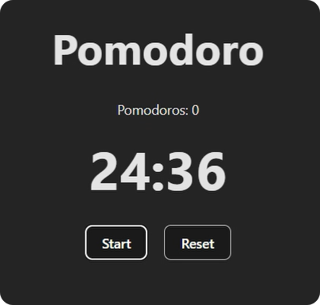

# 🖼️ Pomodoro ReactJs


## 🚀 DEMO
### [Deploy](https://simple-pomodoro-react-js.vercel.app/)

## 💻 Tutorial
<a href='https://youtu.be/QQQQ' target='_blank'>
    
</a>

## 📋 Features
- counter pomodoros
- Work time
- Break time
- Reset
- Start
- Pause

## 📦 Getting Started
```
git clone https://github.com/garu2/Simple-Pomodoro-ReactJs.git
```
```
cd Simple-Pomodoro-ReactJs
```
```
npm install
```
```
npm run dev
```
The app will be available at `http://localhost:5173`

## ⚙️ Technologies
* [Vite.js](https://vitejs.dev/)
* [React](https://reactjs.org/)
* [Vercel](https://vercel.com/)

